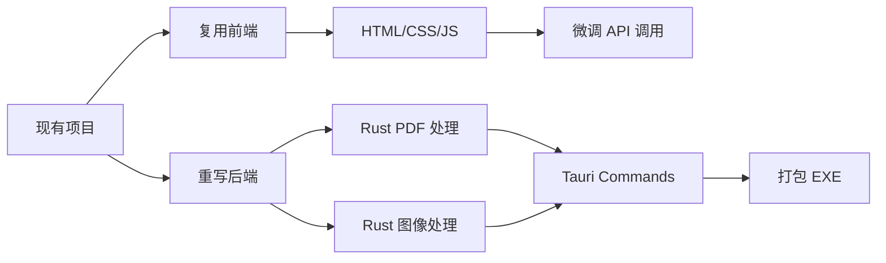

# Windows EXE 分发技术选型

## 需求约束

| 约束 | 要求 |
|------|------|
| 分发形式 | 单一 EXE 或便携文件夹 |
| 外部依赖 | **零依赖**（无需安装运行时/库） |
| 体积 | 尽可能小巧 |
| 打包难度 | 简单，一键构建 |
| 核心功能 | PDF→灰度转换、预览对比、下载 |

---

## 全技术栈对比

| 方案 | 语言 | GUI 框架 | PDF 库 | 打包体积 | 打包难度 | 推荐度 |
|------|------|----------|--------|----------|----------|--------|
| **A. Tauri** | Rust + Web | WebView2 | pdf-rs / pdfium | **3-10 MB** | 简单 | ⭐⭐⭐⭐⭐ |
| **B. Wails** | Go + Web | WebView2 | pdfcpu | **8-15 MB** | 简单 | ⭐⭐⭐⭐ |
| C. Rust egui | Rust | egui (原生) | pdf-rs | **5-12 MB** | 中等 | ⭐⭐⭐⭐ |
| D. Go Fyne | Go | Fyne (原生) | pdfcpu | **15-25 MB** | 简单 | ⭐⭐⭐ |
| E. C# WPF | C# | WPF | PdfSharp | **20-40 MB** | 简单 | ⭐⭐⭐ |
| F. Qt/C++ | C++ | Qt | MuPDF | **15-30 MB** | 复杂 | ⭐⭐⭐ |
| G. PyWebView | Python | WebView | PyMuPDF | **80-150 MB** | 简单 | ⭐⭐ |
| H. Electron | JS | Chromium | pdf.js | **150-300 MB** | 简单 | ⭐ |

---

## 方案 A: Tauri + Rust（强烈推荐）

```
┌─────────────────────────────────────┐
│     单一 EXE (~3-10 MB)             │
├─────────────────────────────────────┤
│  Tauri Runtime                       │
│  └── 使用系统 WebView2 (Win10+内置)  │
├─────────────────────────────────────┤
│  前端: HTML + CSS + JS              │
│  └── 复用现有 Web 界面              │
├─────────────────────────────────────┤
│  Rust 后端                           │
│  ├── pdf-rs / pdfium-render         │
│  ├── image (图像处理)               │
│  └── Otsu + K-means 算法            │
└─────────────────────────────────────┘
```

### 优势

| 优点 | 说明 |
|------|------|
| **极小体积** | 3-10 MB，比 Electron 小 30 倍 |
| **零运行时** | 使用系统自带 WebView2 |
| **高性能** | Rust 原生性能 |
| **复用前端** | 现有 HTML/CSS/JS 几乎无需修改 |
| **安全** | Rust 内存安全 |

### PDF 库选择

| 库 | 说明 | 依赖 |
|----|------|------|
| `pdf-rs` | 纯 Rust，轻量 | 无 |
| `pdfium-render` | 基于 PDFium，功能全 | 需打包 pdfium.dll (~25MB) |
| `lopdf` | 纯 Rust，低级操作 | 无 |
| `mupdf-rs` | MuPDF 绑定，渲染强 | 静态链接 |

### 项目结构

```
pdf-convert-desktop/
├── src-tauri/
│   ├── Cargo.toml
│   └── src/
│       ├── main.rs          # Tauri 入口
│       ├── pdf_converter.rs # PDF 处理逻辑
│       └── commands.rs      # 前端调用接口
├── src/                      # 复用现有前端
│   ├── index.html
│   ├── css/style.css
│   └── js/app.js
├── tauri.conf.json
└── package.json
```

### 核心代码示例

```rust
// src-tauri/src/pdf_converter.rs
use image::{GrayImage, Luma};

pub fn otsu_threshold(img: &GrayImage) -> u8 {
    let histogram = compute_histogram(img);
    // ... Otsu 算法实现
}

pub fn convert_to_grayscale(pdf_path: &str, gray_levels: u8) -> Result<Vec<u8>, Error> {
    let doc = pdf::file::File::open(pdf_path)?;
    // ... PDF 处理逻辑
}

// Tauri 命令
#[tauri::command]
fn convert_pdf(path: String, levels: u8) -> Result<String, String> {
    convert_to_grayscale(&path, levels)
        .map_err(|e| e.to_string())
}
```

### 打包命令

```bash
# 安装 Tauri CLI
cargo install tauri-cli

# 开发模式
cargo tauri dev

# 构建发布版
cargo tauri build
# 输出: target/release/bundle/msi/PDF黑白转换_x.x.x_x64.msi
#       target/release/pdf-convert.exe
```

---

## 方案 B: Wails + Go

```
┌─────────────────────────────────────┐
│     单一 EXE (~8-15 MB)             │
├─────────────────────────────────────┤
│  Wails Runtime (WebView2)            │
├─────────────────────────────────────┤
│  前端: HTML + CSS + JS              │
├─────────────────────────────────────┤
│  Go 后端                             │
│  ├── pdfcpu (PDF 处理)              │
│  └── image (图像处理)               │
└─────────────────────────────────────┘
```

### PDF 库

| 库 | 说明 |
|----|------|
| `pdfcpu` | 纯 Go，功能全面，开源 |
| `unidoc` | 商业授权，功能最强 |
| `go-fitz` | MuPDF 绑定，需 CGO |

### 核心代码示例

```go
// app.go
package main

import (
    "github.com/pdfcpu/pdfcpu/pkg/api"
)

type App struct{}

func (a *App) ConvertPDF(path string, grayLevels int) (string, error) {
    // PDF 处理逻辑
    return outputPath, nil
}
```

### 打包命令

```bash
# 安装 Wails
go install github.com/wailsapp/wails/v2/cmd/wails@latest

# 构建
wails build
```

---

## 方案 C: Rust egui（纯原生 GUI）

```
┌─────────────────────────────────────┐
│     单一 EXE (~5-12 MB)             │
├─────────────────────────────────────┤
│  egui (即时模式 GUI)                 │
│  ├── 文件选择对话框                 │
│  ├── 图像预览面板                   │
│  └── 滑块/按钮控件                  │
├─────────────────────────────────────┤
│  Rust PDF + Image 处理              │
└─────────────────────────────────────┘
```

| 优点 | 缺点 |
|------|------|
| 无 WebView 依赖 | 需要重写 UI |
| 最小体积 | egui 样式较简约 |
| 跨平台 | |

---

## 方案 D: Go + Fyne

```
┌─────────────────────────────────────┐
│     单一 EXE (~15-25 MB)            │
├─────────────────────────────────────┤
│  Fyne (Go 原生 GUI)                  │
├─────────────────────────────────────┤
│  pdfcpu + image                      │
└─────────────────────────────────────┘
```

| 优点 | 缺点 |
|------|------|
| 纯 Go，单二进制 | 需重写 UI |
| 跨平台 | Fyne 控件有限 |

---

## 方案 E: C# + WPF

```
┌─────────────────────────────────────┐
│     单一 EXE (~20-40 MB)            │
│     (Self-contained .NET)            │
├─────────────────────────────────────┤
│  WPF / WinUI 3                       │
├─────────────────────────────────────┤
│  PdfSharp / iTextSharp              │
└─────────────────────────────────────┘
```

### PDF 库

| 库 | 说明 |
|----|------|
| `PdfSharp` | 开源，基础功能 |
| `PdfPig` | 纯 .NET，读取为主 |
| `iTextSharp` | AGPL/商业 |
| `Syncfusion` | 商业，功能全 |

### 打包命令

```bash
dotnet publish -c Release -r win-x64 --self-contained true -p:PublishSingleFile=true
```

---

## 方案 F: Qt + C++

```
┌─────────────────────────────────────┐
│     单一 EXE (~15-30 MB)            │
├─────────────────────────────────────┤
│  Qt6 Widgets / QML                   │
├─────────────────────────────────────┤
│  MuPDF (静态链接)                    │
└─────────────────────────────────────┘
```

| 优点 | 缺点 |
|------|------|
| 成熟稳定 | 构建配置复杂 |
| 性能极佳 | 需要 Qt 授权 (LGPL/商业) |
| 静态链接后无依赖 | |

---

## 最终推荐

### 按场景选择

| 场景 | 推荐方案 | 理由 |
|------|----------|------|
| **最小体积 + 复用前端** | ⭐ **Tauri (Rust)** | 3-10MB，复用 Web UI |
| 最小体积 + 原生 GUI | Rust egui | 5-12MB，无 WebView |
| Go 生态偏好 | Wails (Go) | 8-15MB，开发体验好 |
| Windows 专用 | C# WPF | .NET 生态，企业友好 |
| 快速原型 | PyWebView | 复用现有代码 |

### 综合推荐: Tauri

```
┌────────────────────────────────────────────────────┐
│                  为什么选 Tauri？                   │
├────────────────────────────────────────────────────┤
│  ✅ 体积最小 (3-10 MB vs Electron 200+ MB)         │
│  ✅ 复用现有 HTML/CSS/JS 前端                      │
│  ✅ Rust 后端性能卓越                              │
│  ✅ 使用系统 WebView2，零额外依赖                   │
│  ✅ 一键打包 exe/msi/dmg                           │
│  ✅ 活跃社区，文档完善                              │
└────────────────────────────────────────────────────┘
```

---

## 迁移路径 (当前项目 → Tauri)



### 工作量估算

| 任务 | 工时 | 说明 |
|------|------|------|
| Tauri 项目初始化 | 0.5h | CLI 生成 |
| 复制前端代码 | 0.5h | 直接复用 |
| Rust PDF 处理模块 | 4-8h | 核心逻辑 |
| Otsu/K-means 算法移植 | 2-4h | 算法实现 |
| 前后端接口对接 | 2-4h | Tauri commands |
| 测试与调试 | 2-4h | |
| **总计** | **11-21h** | 约 2-3 天 |
